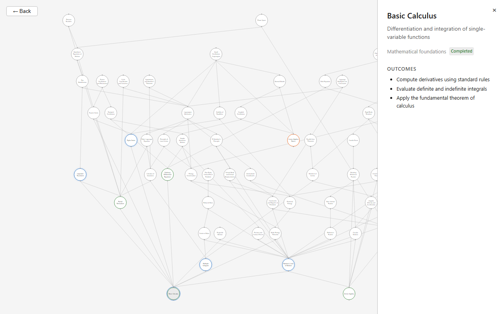
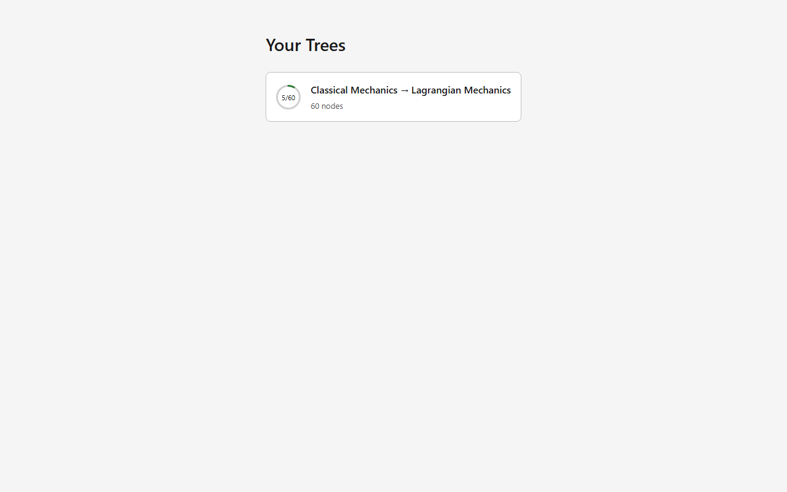

# Arbor

A desktop app that builds a visual prerequisite graph for any subject you want to learn, then teaches you node by node using Socratic dialogue.



## How it works

1. Pick a target topic (e.g. "Lagrangian Mechanics").
2. An AI scopes the prerequisite landscape and builds a directed acyclic graph of concepts.
3. You see the full graph — every node you need to reach your goal. Nodes are color-coded by status: completed, unlocked, locked.
4. Click a node to see its learning outcomes, then enter a Socratic teaching session to master it.
5. Completing nodes unlocks their dependents. Spaced repetition (FSRS) keeps earlier material fresh.



## Tech stack

| Layer | Technology |
|-------|-----------|
| Frontend | React 18, TypeScript, React Flow, ELK.js (layered graph layout) |
| State | Zustand (one store per domain) |
| Backend | Rust, Tauri 2 |
| Database | SQLite (bundled) |
| Math judging | Python sidecar (SymPy) for zero-latency symbolic answer checking |
| Recall | ts-fsrs (Free Spaced Repetition Scheduler) |

## Prerequisites

- **Node.js** 18+
- **pnpm** 11+
- **Rust** stable toolchain
- **Python** 3.10+ (for the SymPy sidecar)
- On Windows/MSYS2: MinGW64 GCC toolchain (`pacman -S mingw-w64-x86_64-gcc`), with `bin/` on PATH

## Development

```bash
pnpm install
pnpm dev          # Vite dev server (port 1421) + Tauri backend
pnpm build        # Production build + Tauri bundle
pnpm test         # Vitest acceptance tests
pnpm lint         # TypeScript strict check + cargo clippy
```

## Project structure

```
src/              React frontend (graph view, learning view, stats)
src-tauri/        Rust backend (Tauri commands, SQLite, FSRS, pipeline)
contracts/        Machine-readable type definitions and schemas (source of truth)
sidecar/          Python SymPy judge (symbolic math checking)
tests/            Acceptance tests organized by ticket
Arbor Spec/       Design vault (architecture, contracts, tickets)
```

## License

All rights reserved.
